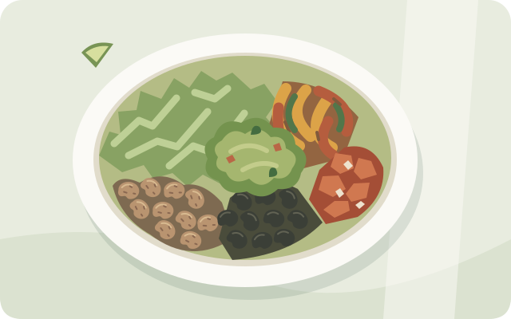
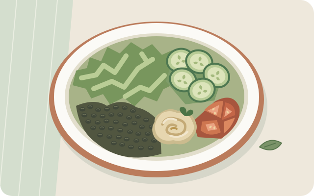
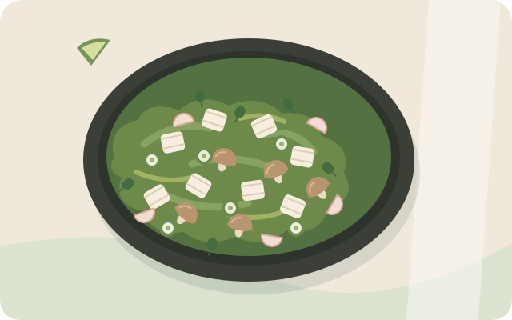

Eating out, without starting over

# Three bowls to keep in your rotation

These build-your-own orders can replace **lunch or dinner** in the [weekly Calendar](../calendar.md) — the office Asian bowl appears on Tuesday, Chipotle on Thursday, and CAVA on Friday. They are vegetarian, dairy-free-by-design adaptations; **staff still need to confirm current ingredients and gluten cross-contact precautions**. They are not allergen-free guarantees.

{ width="640" height="400" loading="lazy" }

## Chipotle: the bean bowl

**Build it:** lettuce + black/pinto beans + fajita vegetables + fresh tomato or tomatillo salsa. Add guacamole if wanted.

**Say this:**

> A vegetarian bowl with no rice, two full servings of beans if available, extra fajita vegetables, lettuce, and tomato salsa. Guacamole on the side. No sofritas, cheese, sour cream, queso, tortilla, or chips.

**Protein check:** the US guide lists **8 g per standard 4 oz serving of beans**. Two full servings provide about **16 g**, plus small contributions from the other ingredients. Half black and half pinto may still be just one serving—ask explicitly. Guacamole is not the protein source.

**Leave out:** rice, corn salsa for this strict trial, tortillas, chips, honey vinaigrette, and dairy. Sofritas is tofu-based, so it is not needed for this order.

{ width="640" height="400" loading="lazy" }

## CAVA: the lentil bowl

**Build it:** greens + a substantial black-lentil portion + Persian cucumber + tomato/onion + a modest red-pepper-hummus scoop. Dressing on the side, only after ingredient checks.

**Say this:**

> A build-your-own bowl with greens and a full serving of black lentils if available, no rice. Cucumber, tomato and onion, and a little red pepper hummus. Skhug or a little harissa on the side. No meat, pita, pita crisps, feta, Crazy Feta, tzatziki, or yogurt dressing. Please confirm the ingredients and gluten precautions.

**Protein check:** the March 2026 guide lists **18 g for its standard black-lentil base serving**, and **2 g for a standard hummus portion**. A half portion of lentils is not the full 18 g. Red pepper hummus is a flavor topping — it contains sesame and is not the protein anchor. Confirm what you are actually being served rather than treating a greens bowl as automatically high-protein.

**Dressings:** skhug (also spelled schug or zhug) and plain harissa are oil-based herb/chile condiments — use a modest amount, on the side. The guide lists roughly **80 and 70 calories per listed serving** respectively, and hot harissa vinaigrette is a separate, oilier dressing. Pick one or two, not all of them.

**Leave out:** rice, pita, pita crisps, dairy dips/toppings, sweet dressings, and falafel for the strict version. Falafel is a fried option, not the protein default here. This is not a claim that plain falafel contains wheat.

{ width="640" height="400" loading="lazy" }

## Office Asian bowl

**Build it:** tofu + mushroom + spring onions + pickled radish + coriander, over greens instead of a rice or noodle base.

**Say this:**

> No rice or noodle base — extra greens or vegetables instead. Tofu, mushroom, spring onions, pickled radish, and coriander. Which sauces are gluten-free? Regular soy sauce contains wheat; tamari or a checked gluten-free sauce works. No creamy or mayo-based dressings.

**Protein check:** the tofu portion is the protein source — ask for a full serving. If the portion is small or tofu is not for you, pair the bowl with eggs or a pulse dish at home rather than treating the vegetables alone as the meal.

**Leave out:** rice and noodle bases, regular soy sauce (wheat), sweet sauces, and creamy dressings. Pickled radish may contain a little sugar — a small garnish is a practical exception, not a serving of pickles. Tofu is a practical adaptation, not explicit Ferriss approval.

*Original illustrations show the proposed ingredient combinations, not restaurant photos or actual portion sizes. Neither brand sponsors this guide.*

## A few decisions that make the order work

- **Do not replace the legumes with extra salad alone.** If the bean/lentil portion is too small, request more if available and tolerated, or complement takeaway with eggs at home. Neither order guarantees 30 g protein.
- **Avoid turning “extra protein” into an uncomfortable portion.** If larger pulse servings cause digestive trouble, choose a different meal rather than forcing them.
- **Guacamole, hummus, tahini, and oils add up.** Use modest amounts; do not stack every dip and dressing. Sesame is an additional allergen in many CAVA dips, separate from gluten and dairy.
- **CAVA roasted vegetables need a current ingredient check.** Confirm the actual mix and seasoning; omit potato or sweet potato if present. Do not infer the restaurant's ingredients from a copycat recipe. Fresh cucumber and tomato are simpler defaults.
- **Named bowls are not the same as these custom orders.** CAVA's published Falafel Crunch Bowl includes dairy and pita crisps; the name “vegetarian” does not make it gluten-free or dairy-free.
- **Choose water or unsweetened tea**, rather than lemonade, juice, or sweetened drinks.

??? warning "Gluten precautions at a shared serving counter"
    Tell staff about your gluten intolerance before ordering. Ask for fresh gloves and clean utensils, and discuss whether ingredients can be served without cross-contact from tortillas or pita. Changing gloves alone cannot guarantee safety. Chipotle explicitly warns that foods can contact one another during preparation; CAVA also warns about shared preparation areas and substitutions. If you have celiac disease, assess their ability to follow your required precautions rather than relying on a “no wheat ingredients” description.

## Sources and limits

Checked **20 September 2026** using US-menu information. Portions, ingredients, and availability can change by location. Nutrition figures are for the chains' listed portions, not measurements of your bowl.

- [Chipotle: allergens and special diets](https://www.chipotle.com/allergens) — confirms beans, vegetables, salsas, and guacamole are vegetarian/vegan; explains cross-contact precautions.
- [Chipotle: US nutrition guide, March 2025 PDF](https://www.chipotle.com/content/dam/chipotle/menu/nutrition/US-Nutrition-Facts-Paper-Menu-3-2025.pdf) — listed bean portions and protein.
- [CAVA: nutrition and allergen information](https://cava.com/nutrition) — the webpage blocked direct access during this check; its publicly accessible official PDF was used for nutrition figures.
- [CAVA: March 2026 nutrition and allergen guide PDF](https://assets.ctfassets.net/kugm9fp9ib18/7KrOGNUFZjBddOWezWLWwm/a20b10d71b9b0496f96b8e38bd8e0211/CAVA-REC-GID-0326-AllergReg.pdf) — not a certification of an individual restaurant's preparation. Check the current allergen chart with staff; text extraction does not reliably preserve the chart's graphical allergen markers.
- [CAVA: Falafel Crunch Bowl](https://cava.com/menu/falafel-crunch-bowl) — lists milk, sesame, and wheat for the composed bowl.
