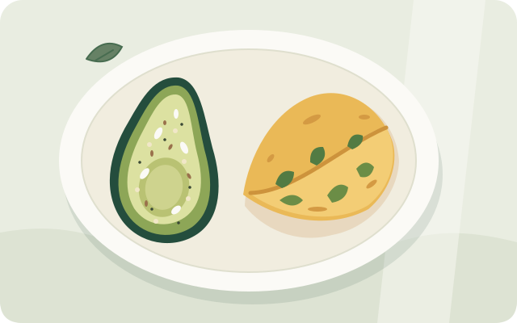

# Everyday recipes

These are **recipe adaptations**, not claims of exact Ferriss approval. The meals are gluten-free and dairy-free with appropriate ingredient checks. Eggs and pulses are the main protein choices; none of these recipes requires tofu. Small amounts of lemon or tamarind are practical culinary exceptions. See [principles](../principles.md) and [sources](../sources.md).

Protein estimates are approximate, depend on ingredient size and labels, and are not individualized targets. Dry pulse quantities are measured **before soaking**.

## Fixed breakfast: avocado and spinach omelette

{ .recipe-illustration width="640" height="400" }

*Original food illustration; use the written quantities below for portions.*

**Serves 1. Repeat daily if it suits your appetite and tolerance.** This is the default breakfast in the [starter week](starter-week.md), including the flexible day. No batter preparation or breakfast rotation is required.

### Your fixed plate

- **½ medium avocado**, about 75 g edible flesh; actual sizes vary
- **2 whole eggs + 2 additional egg whites**, using large eggs
- A generous handful of **spinach**, about 30 g before cooking
- **1 tablespoon hemp hearts**, about 10 g
- **1 teaspoon ground flaxseed**
- **1 teaspoon pine nuts**
- A light sprinkle of **everything-bagel seasoning**
- About 1 teaspoon cooking oil, or enough for your pan
- Chilli, turmeric, pepper, and salt as preferred; account for salt already in the seasoning

### Make it

1. Top the avocado with the measured hemp hearts, ground flaxseed, pine nuts, and seasoning.
2. Beat the whole eggs and additional whites with your preferred spices. No milk, butter, cream, or cheese is needed.
3. Warm the oil in a skillet and briefly wilt the spinach. Add the eggs and cook the omelette until set throughout. Serve beside the avocado.

### Protein, without overpromising

| Part of the meal | Approximate protein |
| --- | --- |
| 2 large whole eggs | 12–13 g |
| 2 additional large egg whites | About 7 g |
| ½ medium avocado | 1.5–2 g |
| Hemp hearts, 1 tablespoon | About 3 g |
| Ground flaxseed and pine nuts, 1 teaspoon each | About 1 g combined |
| Raw spinach, about 30 g | About 1 g |
| **Complete plate** | **Roughly 26–28 g** |

**Keep the choice simple:** use the two-extra-white version as your default. If you specifically want to approach Ferriss's roughly 30 g breakfast target, use **3 additional whites instead of 2**; that adds about 3.6 g protein. If you prefer only the two whole eggs, the same plate is closer to **19–21 g**. Ferriss's target is **not a universal requirement**, and none of these estimates guarantees weight loss.

Carton egg whites can save separating eggs; use the label's equivalent quantity. Do not add extra nuts or seeds just to chase protein. Keep toppings measured and use ground rather than intact flaxseed.

!!! note "Seasoning and daily-use checks"
    Everything-bagel seasoning is not bread: a plain sesame, poppy seed, garlic, onion, and salt mix can fit. Check the specific label for gluten ingredients, cross-contact information, and added sugar. If you have high LDL cholesterol or a clinician has advised limiting yolks, discuss the two-yolk daily pattern rather than treating it as a universal prescription.

## Mung-only pesarattu

Also called **green gram dosa, pachai payaru dosai, or pesara dosa** — the pulse-batter dosa in the Tuesday and Wednesday dinners. **Serves 2.** Makes about four medium pancakes, depending on thickness. This is an optional lunch/dinner accompaniment, not a required replacement for the fixed breakfast.

*Video references: [green gram dosa / pesarattu](https://youtube.com/shorts/an6KSg8MZWU) and [healthy moong dal dosa](https://youtube.com/shorts/JDbGn1_yozg) — external recipe videos, not endorsements.*

- ½ cup dry whole mung beans, approximately 100 g
- 1 cm ginger, ½ teaspoon cumin, optional green chilli
- Approximately ⅓–½ cup water for blending, more as needed
- 2 teaspoons oil for the pan; salt to taste

1. Soak mung in plenty of water for 8–12 hours in the refrigerator; drain and rinse.
2. Blend with ginger, cumin, chilli, salt, and enough water for a pourable but not watery batter. No rice or rice flour is needed.
3. Lightly oil a medium-hot skillet. Spread a quarter of the batter thinly. Cook until the top loses its wet sheen and the underside browns; flip and cook through. Repeat, adjusting heat so the center cooks before the outside burns. Resist adding rice flour for extra crispness — that makes it a grain-based dosa. For crisper edges, substitute a spoonful of plain besan or extra ground chana dal instead.
4. Divide between two plates. Serve with egg bhurji, a substantial dal dish, or vegetables as part of a fuller meal.

**Approximate protein:** roughly 10–15 g per serving of pancakes. Chutney alone does not make this a high-protein complete meal.

## Mixed-dal protein dosa (rice-free adai)

**Serves 3–4.** The viral “protein dosa” made strict-day-friendly: most popular versions soak the dals **with rice**, which keeps them off the six strict days. This version drops the grain entirely — an all-pulse adai. The original rice version remains a flexible-day option.

- ¼ cup toor dal, about 50 g
- ¼ cup chana dal, about 50 g
- ¼ cup whole mung / pachai payaru, about 50 g
- ¼ cup urad dal, about 50 g
- 2–3 dried red chillies, 1 teaspoon cumin, ½ inch ginger
- Curry leaves, salt, and optional gluten-free hing
- Water for soaking and grinding; oil for the pan

1. Soak the dals together for 4–6 hours, refrigerated; drain and rinse.
2. Grind with the chillies, cumin, ginger, and salt plus enough water for a thick, spreadable, slightly coarse adai-style batter. No rice, no fermentation needed.
3. Spread on a medium-hot tawa a little thicker than a dosa; cook both sides with a little oil until the edges crisp.
4. Serve with sambar or a sugar-free chutney. Add eggs or a pulse side if you want a larger protein serving.

**Approximate protein:** roughly 12–15 g per serving of two medium adais, before accompaniments. “Protein dosa” oversells the pancakes alone — the dal content is real but modest per serving.

*Video reference: [Kani akka protein dosa](https://youtube.com/shorts/13WO2-uSAZA) — the televised version includes rice; the recipe above substitutes an equal volume of dal. See [if a recipe calls for rice](dishes.md#if-a-recipe-calls-for-rice-substitute-or-skip).*

## Egg bhurji

**Serves 2.** Use with pesarattu or vegetables; eggs do not need to appear in every lunch and dinner.

- 4 large whole eggs and 4 additional whites
- 100 g onion, chopped
- 200 g tomato, chopped
- 100 g spinach, chopped
- 2 teaspoons oil
- ½ teaspoon cumin seeds, ¼ teaspoon turmeric
- Chilli, black pepper, and salt to taste
- Optional: 1 teaspoon lemon juice for the whole batch

1. Beat the eggs and whites. Heat oil in a skillet; add cumin, then onion, and cook until softened.
2. Add tomato, turmeric, and chilli. Cook until the tomato breaks down, then wilt the spinach.
3. Add the egg mixture and stir gently until set throughout. Adjust seasoning and finish with optional lemon. Do not add milk or cream.

**Approximate protein:** around 20 g per serving from the eggs and whites, plus a little from vegetables. Two plain whole eggs without the extra whites supply only about 12–13 g.

## Spiced boiled eggs and shakshuka options

For **spiced boiled eggs**, halve two fully hard-boiled eggs. Warm a little oil with chilli powder, turmeric, and salt, taking care not to burn the spices. Place the cut sides down briefly to coat and warm them. Serve with pappu and vegetables if you want an egg-based lunch. Two whole eggs provide about 12–13 g protein; these are an optional addition, not included in the first-three-day shopping list.

For **shakshuka**, soften onion and capsicum in oil, add chopped tomatoes and spices, and simmer into a thick sauce. Make wells for two eggs per person, cover, and cook until the whites and yolks are firm. Add extra whites if wanted. Skip feta, cream, sweetened sauce, and bread; use a pulse dosa as an accompaniment. Shopping for this later-week option is separate from the three-day starter list.

## Ridge gourd moong pappu

**Serves 3.** Serve with a substantial vegetable side. Optional spiced eggs or a pulse dosa can make a larger meal; tofu is not required.

- 1 cup dry split yellow moong dal, approximately 200 g, rinsed
- 600 g ridge gourd, peeled and chopped
- 200 g tomato and 100 g onion, chopped
- 3 cups water initially; more as needed
- 2 teaspoons oil, ½ teaspoon mustard seeds, ½ teaspoon cumin
- ¼ teaspoon turmeric, curry leaves, salt, and chilli to taste

1. Taste a small piece of ridge gourd before cooking; discard the whole vegetable if unusually bitter.
2. Bring dal, water, and turmeric to a boil, then simmer partly covered until beginning to soften. Add water if needed to prevent sticking.
3. Add gourd and tomato. Simmer until dal is fully soft and vegetables are tender; mash lightly. Cooking time varies with the dal and pan.
4. In another pan, heat oil and crackle mustard and cumin. Add onion, curry leaves, and chilli; cook until onion softens. Stir into the dal and season.

**Approximate protein:** about 15–20 g per serving. A thin ladle of pappu is less than one-third of this batch. The lunch menu is not a guarantee of 30 g protein.

## Green bean paruppu usili

**Serves 3.** A pulse-and-vegetable dish, not a deep-fried preparation. Serve with cowpea curry or another tolerated meal component; adjust pulse portions to appetite and digestion.

- ¾ cup dry chana dal, approximately 150 g
- 600 g green beans, trimmed and chopped
- 1 teaspoon cumin, optional dried chilli
- 1 tablespoon oil, ½ teaspoon mustard seeds
- Curry leaves, pinch of turmeric, salt to taste

1. Soak chana dal in the refrigerator for 6–8 hours. Drain; coarsely grind with cumin, chilli, salt, and just enough water to move the blades.
2. Spread in a shallow greased steamer dish. Steam until fully cooked and firm throughout, usually around 20 minutes depending on thickness. Check the center; extend cooking if still raw or gritty. Cool slightly and crumble.
3. Steam or simmer beans until tender; drain excess water.
4. Heat oil, crackle mustard, and add curry leaves and turmeric. Add pulse crumbles and beans; stir until hot, breaking up clumps. No rice flour is needed.

**Approximate protein:** roughly 10–15 g per serving, before accompaniments. Do not force large combined pulse servings merely to reach a number.

## Simple cowpea curry

**Serves 2.** Use karamani, alasandalu, or black-eyed peas. This is a simple curry, not a claim to reproduce every traditional kuzhambu recipe.

- 150 g dry cowpeas, or enough drained cooked/canned cowpeas for about 2 cups
- 100 g onion and 200 g tomato, chopped
- 2 teaspoons oil
- ½ teaspoon cumin, ¼ teaspoon turmeric, curry leaves
- Chilli and salt to taste; water as needed

1. If using dried cowpeas, sort, rinse, soak, and cook fully using a reliable bean-specific method or the package directions. Do not treat soaking as cooking. Drain canned beans and rinse if preferred.
2. Soften onion in the oil with cumin and curry leaves. Add tomato, turmeric, and chilli, and cook until softened.
3. Add cooked cowpeas and enough water for a curry consistency. Simmer together and season.

A cooked cup of cowpeas supplies roughly 12–14 g protein. Actual yield and serving size vary. Start with less if pulses cause discomfort; the recipe is not a required minimum serving.

## Adapted avial without yogurt

**Serves 3 as a side, not a protein dish.**

- 200 g ash gourd, 150 g snake gourd, and 150 g long beans
- 1 drumstick pod, approximately 100 g, cut into lengths
- 1 small carrot, approximately 75 g
- 3 tablespoons grated unsweetened coconut
- ½ teaspoon cumin, optional green chilli
- ¼ teaspoon turmeric, 1 teaspoon oil, curry leaves, salt
- 1 teaspoon unsweetened tamarind pulp diluted in ¼ cup water; use less if concentrated

1. Cut vegetables into similar-sized pieces. Simmer drumstick, beans, and carrot with turmeric and enough water to prevent sticking. Add gourds and cook until all are tender.
2. Grind coconut, cumin, and chilli with a little water. Stir into the vegetables with diluted tamarind and simmer briefly.
3. Finish with oil and curry leaves; adjust salt. Eat the soft drumstick interior and discard its fibrous shell.

No yam, taro, raw banana, potato, or yogurt. Protein is low, only a few grams per side serving; pair with a substantial pulse dish or eggs rather than counting avial as the meal's protein.

## Lemon-marinated carrot–radish salad and kimchi

**Serves 1 as two vegetable sides.** Scheduled with egg bhurji and rice-free pesarattu on Tuesday in the [weekly Calendar](../calendar.md). Keep the main protein; these sides are not substitutes for eggs or pulses.

- 1 small carrot, about 50–75 g
- About 50 g radish / mullangi / mooli
- A small squeeze of lemon or lime juice, about 1–2 teaspoons to start
- A little salt, to taste
- About 2 tablespoons **vegetarian, gluten-free kimchi** to serve alongside

1. Wash the vegetables before cutting. Slice or cut them into sticks and place in a clean, covered container.
2. Toss with lemon or lime juice and a little salt. Do not add sugar, honey, or jaggery.
3. Refrigerate promptly at **4°C/40°F or below**. Prepare a small batch for the next day or two; for Tuesday dinner, make it earlier that day or on Monday evening. This is **not a shelf-stable pickle**: lemon juice and a sprinkle of salt do not make it suitable for indefinite storage or room-temperature keeping.
4. Serve the salad beside the kimchi. There is no need to drink the leftover marinade. Adjust the portions to appetite and tolerance, and go lightly on added salt because kimchi can already be salty.

Ferriss explicitly lists kimchi. Choose a confirmed vegetarian and gluten-free product: traditional versions can contain fish sauce or shrimp, and some use wheat-containing ingredients. Follow the product's refrigeration and storage instructions. A little rice paste used in a kimchi recipe is not treated here as a reason to ban a small kimchi side; it is different from making rice the meal's base. Small culinary quantities of lemon/lime are a practical adaptation to the author's fruit rule.

## Peanut sundal with carrot and tomato

**Serves 2 as a side.** Scheduled with Thursday's usili dinner and Saturday's zucchini noodles in the [weekly Calendar](../calendar.md). Boiled peanuts are energy-dense; the measured **¼ cup shelled peanuts per serving** keeps this a side, not the meal's protein anchor.

- ½ cup shelled **boiled peanuts** total, divided into ¼ cup per serving — simmer raw shelled peanuts until tender, or drain canned boiled peanuts
- 1 small carrot, about 75 g, grated or finely chopped
- 1 small tomato, about 100 g, chopped
- A handful of coriander leaves, chopped
- A squeeze of lime juice, about 1–2 teaspoons
- Chilli powder and salt to taste
- Optional: a quick tempering of 1 teaspoon oil with mustard seeds and curry leaves

1. If starting with raw shelled peanuts, simmer them in water until tender — often 45–60 minutes depending on the peanuts. Drain and cool. Canned boiled peanuts only need draining; rinse if they are heavily salted.
2. Toss the peanuts with carrot, tomato, coriander, lime juice, chilli powder, and salt. Add the optional tempering if you like.
3. Serve fresh. Refrigerate leftovers promptly in a covered container and use within a day or two; the tomato softens over time.

**Approximate protein:** about 6 g per ¼-cup serving of boiled peanuts; the vegetables add little. Keep a substantial pulse or egg dish as the meal's protein. Salted boiled peanuts can already be high in sodium — taste before adding salt, and keep the portion measured rather than eating from a large bowl.

## Zucchini noodles with peppers and lentil sauce

**Serves 2.** Scheduled for Saturday dinner in the [weekly Calendar](../calendar.md). Spiralized zucchini stands in for grain noodles; the red-lentil tomato sauce supplies the protein. Cook the zucchini only briefly so it stays firm rather than watery.

- ½ cup dry red lentils (masoor dal), about 100 g, rinsed
- 300 g tomato, chopped, or about 1 cup crushed tomato without added sugar
- ½ teaspoon cumin, ¼ teaspoon turmeric, chilli and salt to taste
- 2 medium zucchini, about 400 g, spiralized or cut into thin strips
- 1 capsicum/bell pepper, sliced
- 2–3 garlic cloves, sliced
- 2 teaspoons oil
- Optional: chopped coriander and a squeeze of lime

1. Simmer the lentils with tomato, cumin, turmeric, chilli, and about 1½ cups water until fully soft and saucy, roughly 15–20 minutes. Mash lightly and season. No cream, cheese, or sugar is needed.
2. In a wide pan, warm the oil and briefly cook the garlic and capsicum. Add the zucchini noodles and toss for only 1–2 minutes until just tender; overcooking releases their water.
3. Plate the noodles and ladle the lentil sauce over. Finish with coriander or lime if you like.

**Approximate protein:** roughly 10–12 g per serving from the lentils, varying with the dal and portion. Add spiced boiled eggs or a pulse side for a larger protein serving. Jarred pasta sauces often contain added sugar or cheese — check labels if you use one instead of the lentil sauce.

## Kambu dosa (pearl millet): a flexible-day recipe

**Not a strict-day food.** “No rice” does not mean grain-free: kambu is pearl millet/bajra/sajjalu, a grain that stays outside the six strict days just like rice — see [millet carbs](../foods/staples-extras.md#millet-carbs-compared-honestly). It is naturally gluten-free and dairy-free, so it is a reasonable **flexible-day** choice and a better grain pick than a plain white-rice dosa for fiber and protein. This version uses more urad dal than many recipes for a better protein ratio.

- 1 cup pearl millet (kambu/bajra), about 200 g
- ½ cup urad dal, about 100 g
- ½ teaspoon fenugreek/methi seeds
- Salt to taste
- A little oil for the pan

1. Rinse and soak the millet in plenty of water for 6–8 hours or overnight; soak the urad dal with fenugreek separately for 3–4 hours. Refrigerate during long soaks in a warm kitchen.
2. Drain. Grind the urad dal first until light and fluffy, then add the millet and grind to a smooth, pourable batter with water as needed. Add salt.
3. Ferment 8–12 hours until risen and slightly tangy; timing depends on room temperature.
4. Cook on a medium-hot tawa like an ordinary dosa, spreading thin. Use a little oil for crispness.

**Flexible-day role:** serve with a sambar that carries a substantial dal portion, and chutney without added sugar. A couple of dosas is a meal portion, not an all-day snack. On strict days, the [mung-only pesarattu](#mung-only-pesarattu) is the grain-free option.

*Video reference: [no-rice crispy kambu dosa](https://youtube.com/shorts/wqZultrzxDo) — an external recipe video, not an endorsement. For strict days, substitute the millet batter with the [all-pulse pesarattu or adai batter](#mung-only-pesarattu) — same soak-grind-cook method, no grain.*

## Karuppu ulunthu: black urad dosa

**Serves 2.** Another “no rice, no ferment” pulse dosa — this time built on whole black urad (karuppu ulunthu / minapappu). It follows the same method as the [mung-only pesarattu](#mung-only-pesarattu); whole urad takes a little longer to soak and grinds fluffier.

- ½ cup whole black urad, about 100 g
- 1 cm ginger, ½ teaspoon cumin, optional green chilli
- Salt; water for blending; 2 teaspoons oil for the pan

1. Soak the urad for 6–8 hours, refrigerated; drain and rinse.
2. Grind with ginger, cumin, chilli, salt, and water into a smooth, pourable batter. No fermentation needed for the instant version — or rest it a few hours for a softer result.
3. Cook on a medium-hot tawa like a dosa, spreading thin; oil the edges lightly and cook both sides.

**Approximate protein:** roughly 12–15 g per serving of pancakes, before accompaniments. Pair with sambar or a vegetable side.

*Video reference: [black urad dal dosa / karuppu ulunthu dosa](https://youtube.com/shorts/5-Z4-KTvMS4) — an external recipe video, not an endorsement.*

## Dal idli without rice

**Makes about 12 idlis.** “No-rice idli” videos come in two kinds: all-dal batters that fit strict days, and millet, poha, or suji batters that are still grain. This is the all-dal version — steamed pulse cakes with no rice and no rava.

- ½ cup urad dal, about 100 g
- ¼ cup yellow moong dal, about 50 g
- ¼ cup chana dal, about 50 g
- ½ teaspoon fenugreek/methi seeds
- Salt; a little oil for the moulds

1. Soak the dals with the fenugreek for 5–6 hours, refrigerated; drain and rinse.
2. Grind the urad and moong smooth; grind the chana dal slightly coarse. Mix with salt and ferment 8–12 hours like idli batter.
3. Pour into greased idli moulds and steam 10–12 minutes until a skewer comes out clean. Rest a few minutes before unmoulding.
4. Instant version: skip fermentation and fold in about 1 teaspoon of plain Eno/fruit salt just before steaming — check the label for added ingredients.

**Approximate protein:** roughly 4 g per idli; a serving of 3–4 idlis supplies about 12–16 g before sambar or chutney. Steamed, not fried — and no grain in the batter. Serve with a substantial sambar.

*Video reference: [no-rice idli](https://youtube.com/shorts/AfMnTIgBuEQ) — check that the version you follow uses dal only, not millet, poha, or suji.*

## Sattu chilla: a no-knead pulse “roti”

**Serves 2.** Sattu is roasted Bengal gram flour — a pulse flour like besan, not a grain — so this instant flatbread fits strict days. Choose a plain sattu and check gluten labeling, as with any flour.

- ½ cup sattu, about 60 g
- About ½ cup water, added gradually for a thick batter
- ¼ cup finely chopped onion, ¼ cup grated cucumber or chopped moringa leaves
- Green chilli, grated ginger, ¼ teaspoon ajwain/carom, ¼ teaspoon cumin, turmeric, salt
- Optional gluten-free hing; a little oil for the pan

1. Mix everything into a thick, spreadable batter; rest 5–10 minutes so the sattu hydrates.
2. Cook on a medium-hot pan like a thick chilla or roti, a few minutes per side with a little oil.

**Approximate protein:** roughly 8–10 g per serving from the sattu alone — pair with dal, eggs, or a vegetable-pulse side for a full meal.

*Video reference: [no-knead high-protein sattu roti](https://youtu.be/SME8yQGQyhY) — an external recipe video, not an endorsement.*

## Cabbage rolls with spiced dal filling

**Serves 2–3.** The cabbage-leaf wrap is the clever part of the paneer momo videos — a grain-free “skin”. Paneer is dairy, so this version fills them with a spiced dal mixture instead. A steamed, not fried, snack or light meal alongside dal.

- 8–10 large cabbage leaves
- 1 cup cooked chana or whole mung, mashed coarsely
- 1 small grated carrot, chopped spring onion or onion, ginger, green chilli
- ½ teaspoon cumin, garam masala or sambar powder, salt; a teaspoon of oil

1. Blanch cabbage leaves 1–2 minutes until pliable; trim thick ribs. Drain well.
2. Mix the mashed pulses with vegetables and spices. Place a spoonful on each leaf and roll, tucking the sides.
3. Steam 8–10 minutes, or pan-cook seam-side down with a lid and a splash of water. Serve with a sugar-free chutney.

**Approximate protein:** roughly 10–12 g per serving from the dal filling. Egg bhurji also works as a filling if you prefer it to the dal mixture.

*Video reference: [spicy cabbage rolls](https://youtube.com/shorts/YvDCjdyr7fM) — the original uses paneer; this version swaps in dal for a dairy-free filling.*

## Cauliflower and chickpea bowl

**Serves 2.** A pulse-and-vegetable bowl that fits as written once the “creamy” part is dairy-free: use coconut milk or blended cauliflower for body instead of cream or yogurt.

- 400 g cauliflower florets
- 1½ cups cooked chickpeas (or 1 can, drained and rinsed)
- 1 onion and 2 tomatoes, chopped
- 2 teaspoons oil, ½ teaspoon cumin, turmeric, chilli, curry leaves, salt
- About ½ cup light coconut milk, or blend a ladle of the cooked cauliflower with water

1. Roast or sauté the cauliflower until browned at the edges; set aside.
2. Soften onion with cumin and curry leaves, add tomato and spices, and cook down.
3. Add chickpeas and the coconut milk or blended-cauliflower base; simmer a few minutes. Fold in the cauliflower and season.

**Approximate protein:** roughly 12–14 g per serving from the chickpeas. Serve over cabbage or on its own — no rice needed.

*Video reference: [cauliflower and chickpea bowl](https://youtube.com/shorts/b_ZqgXZG1eM) — use coconut milk or blended cauliflower wherever the video uses cream or yogurt.*

## Besan chilla sandwich

**Serves 2.** The “no bread sandwich” videos cook a besan batter in a sandwich maker — the base already fits. The usual paneer-and-curd filling is dairy, so this version keeps the vegetables and swaps in a spiced chana or egg filling.

- ½ cup besan/chickpea flour (plain, gluten-free)
- About ⅓ cup water for a thick batter
- Chopped onion, capsicum, tomato, green chilli, coriander; cumin, chilli, salt
- Filling: spiced mashed chana, scrambled egg, or leftover usili
- Oil for the plates or pan

1. Whisk the batter with the chopped vegetables and spices; rest 5 minutes.
2. Spoon onto a greased sandwich maker or pan, add the filling, cover with a little more batter, and cook until golden on both sides. On a tawa, make two small chillas and sandwich the filling between them.

**Approximate protein:** roughly 10–14 g per serving depending on the filling. Paneer is dairy — the mashed-chana or egg filling keeps it dairy-free.

*Video reference: [no-bread sandwich](https://youtube.com/shorts/GZZUo8Ar7Z0) — the original uses paneer and curd; this version is the dairy-free adaptation.*

## Cooking and storage

!!! warning "Store batches safely"
    Cook pulses thoroughly; soaking alone is not cooking. Cook omelettes and bhurji until set, not runny. Refrigerate cooked food in shallow containers within two hours, or one hour above 32°C/90°F. Use refrigerated leftovers within 3–4 days and freeze extras promptly; do not keep a whole week's meals in the refrigerator. Reheat leftovers thoroughly to 74°C/165°F. Follow carton egg-white storage directions and thaw frozen portions in the refrigerator.

See the [starter week](starter-week.md) for quantities that reuse these batches.
